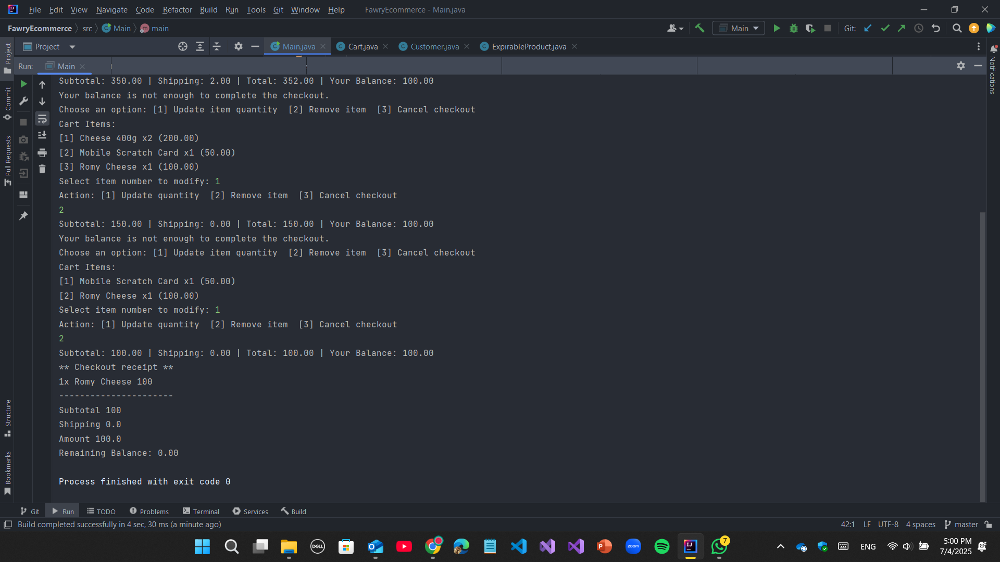

# E-Commerce Checkout System (Java)

A simple object-oriented Java console application that simulates a mini e-commerce checkout system with the following features:

---

## ✨ Features

- Define various products with name, price, and quantity
- Handle **expirable** and **non-expirable** products
- Support **shippable** products with weight-based shipping fees
- Add items to cart with quantity constraints
- Perform checkout with:
  - Subtotal calculation
  - Shipping cost calculation
  - Total amount deduction from customer balance
  - Shipment notice for applicable items
- Error handling for:
  - Expired products
  - Quantity exceeding stock
  - Empty cart
  - Insufficient balance
- User-friendly options to resolve product issues during checkout (update quantity, remove item, or cancel checkout)

---

### Running the App

```bash
javac Main.java
java Main

✅ Example Console Output
markdown
Copy
Edit
** Shipment notice **
2x Cheese 400g
1x Biscuits 700g
Total package weight 1.1kg

** Checkout receipt **
2x Cheese 400g 200
1x Biscuits 700g 150
1x Mobile Scratch Card 50
----------------------
Subtotal 400
Shipping 5.5
Amount 405.5
Remaining Balance: 594.5
---
### 📌 Notes
The app uses console interaction (via Scanner) to let users resolve product issues at checkout.

Shipping cost is calculated as 5 × totalWeight (customizable).

The system is modular and easy to extend with payment gateways, UI, or databases.

## 📸 Demo Screens

### ✅ 1. Successful Checkout

Displays checkout with subtotal, shipping, and updated balance.

---

### ❌ 2. Expired Productz


Shows system preventing checkout of expired items.

---

### ⚠️ 3. Quantity Exceeds Stock


Prompts user to update quantity, remove item, or cancel.

---

### 🧾 4. Insufficient Balance



Alerts the user that they don’t have enough funds.

---

### 🚫 5. Empty Cart


Prevents checkout when the cart is empty.

